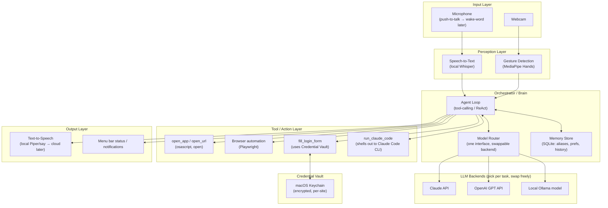

# System Design

## High-level architecture



**Why it's shaped like this:** every input modality (voice, gesture) feeds the
*same* agent loop through the *same* tool contract — the loop never has an
if-this-was-voice branch. That's what lets Phase 5 (gestures) plug in without
touching Phases 1-4. Same idea on the output side: the loop doesn't know or care
which LLM backend answered, only that it got back either a spoken reply or a tool
call — that's what makes the backend genuinely swappable instead of "swappable in
theory, Claude-shaped in practice."

## Components

### 1. Input layer
- **Mic:** push-to-talk hotkey in Phase 1, wake-word in Phase 8. Runs as a
  background daemon, so macOS mic-permission-for-background-processes needs to be
  proven in Phase 0 before anything else is built on top of it.
- **Webcam:** opened only while gesture mode is active (don't leave the camera
  hot all the time — both for battery and for the obvious trust reasons).

### 2. Perception layer
- **STT:** local Whisper (`faster-whisper` or `whisper.cpp`). Local because voice
  commands routinely contain credentials, project paths, and other things that
  don't need to leave your machine just to get transcribed.
- **Gesture detection:** MediaPipe Hands gives you 21 hand landmarks per frame in
  real time on CPU — plenty for a small fixed gesture vocabulary (Phase 5). No
  need for a custom-trained model to start.

### 3. Orchestrator / Brain
- **Model Router:** a thin interface — `complete(messages, tools) -> reply | tool_call`
  — with one implementation per backend (Claude, GPT, Ollama). This is the piece
  that makes "try what works best" (your words) actually practical: swapping
  backends is a config change, not a rewrite. `LiteLLM` is a reasonable
  off-the-shelf implementation of exactly this interface if you don't want to
  hand-roll it — see doc 03.
- **Agent loop:** classic tool-calling loop — send transcript + tool definitions
  + relevant memory to the router, get back either a spoken reply or a tool call,
  execute the tool, feed the result back in, repeat until done. This *is* "the
  agent" — there's no more mysterious machinery underneath it than this loop.
- **Memory store:** SQLite is enough at this scale. Two kinds of memory:
  short-term (recent conversation turns, for context) and long-term (aliases like
  "my project" → path, preferences like default voice/backend). Long-term memory
  is retrieved selectively per request, not dumped wholesale into every prompt.

### 4. Tool / Action layer
Each tool is a small, testable function with a fixed input schema the model can
call — this is the entire "agent capability" surface, and it only grows when a
phase explicitly adds a tool:
- `open_app(name)`, `open_url(url)` — Phase 3.
- `run_claude_code(project_path, task)` — shells out to the `claude` CLI, captures
  stdout/exit status, and reports back conversationally. Jarvis treats Claude Code
  as an opaque, already-excellent sub-agent — it does not try to reimplement any
  of what Claude Code already does.
- Browser automation (`open_portal`, `fill_login_form`) — Playwright, chosen over
  raw Selenium for a much simpler API and built-in waiting/retry behavior.
  - **Revised 2026-09-08 (Phase 4):** both, behind one interface, chosen by
    `actions.browser.engine`. Playwright's Firefox is a *patched* build speaking
    a protocol (Juggler) that stock Firefox doesn't implement, so Playwright
    cannot drive the Firefox you have installed — verified by pointing it at
    `/Applications/Firefox Developer Edition.app`, which fails to launch. Since
    "use my own browser, with my own logins" is a real requirement and not a
    preference, the default engine is now `system-firefox`: the installed
    Firefox, your own profile, driven through **geckodriver** (Mozilla's driver,
    the supported way to automate stock Firefox). Playwright's browsers remain
    available as engines and keep their simpler API where it's enough.
  - The hard limit, true of every option: a driver has to *launch* the browser.
    Nothing can attach to the Firefox window already open on screen short of a
    browser extension, and a profile can only be open in one process — so Jarvis
    asks you to quit Firefox rather than failing obscurely.
- Gesture-mapped meta-actions (`confirm`, `cancel`) — Phase 5, reuse the same tool
  contract voice already established.

### 5. Credential vault
See **doc 04** for the full design — summarized here only as a component: a
thin wrapper around the macOS Keychain (via the `security` CLI or a small
`keyring`-based Python layer), addressed by site/portal name, never held as
plaintext outside of the brief in-memory window needed to type it in.

### 6. Output layer
- **TTS:** start with something free and local (macOS's built-in `say`/
  `AVSpeechSynthesizer`, or Piper for a more natural voice) behind the same
  swappable-backend pattern as the brain, so a cloud voice (ElevenLabs, OpenAI TTS)
  is a config change away once you care about voice quality more than you care
  about zero marginal cost.
- **Menu bar / notifications:** lightweight status surface — listening / thinking
  / speaking / running a sub-agent — so a multi-minute `run_claude_code` call
  doesn't look like Jarvis hung.

## Example flow: "Open this portal, use this username/password to login"

```mermaid
sequenceDiagram
    participant You
    participant STT
    participant Loop as Agent Loop
    participant Router as Model Router
    participant Browser as Playwright Tool
    participant Vault as Credential Vault

    You->>STT: "Open the billing portal, username is..."
    STT->>Loop: transcript
    Loop->>Router: transcript + tool defs + memory (portal alias)
    Router-->>Loop: tool_call: open_portal(url)
    Loop->>Browser: open_portal(url)
    Browser-->>Loop: page loaded, login form detected
    Loop->>Router: "form found, credential needed"
    Router-->>Loop: tool_call: fill_login_form(site, username, password)
    Loop->>Vault: store_or_fetch(site, username, password)
    Loop->>Browser: fill_login_form(...)
    Browser-->>Loop: filled, awaiting confirmation
    Loop-->>You: (spoken) "Filled in, want me to submit?"
```

## Example flow: "Open this project, use Claude Code to find this bug"

```mermaid
sequenceDiagram
    participant You
    participant STT
    participant Loop as Agent Loop
    participant Router as Model Router
    participant CC as run_claude_code Tool

    You->>STT: "Open project X, use Claude Code to find this bug: ..."
    STT->>Loop: transcript
    Loop->>Router: transcript + tool defs + memory (project alias → path)
    Router-->>Loop: tool_call: run_claude_code(path, task)
    Loop->>CC: launch `claude` CLI in path with task prompt
    CC-->>Loop: streamed progress / final result
    Loop-->>You: (spoken) summary of what Claude Code found/fixed
```

## macOS-specific concerns to solve early (Phase 0)

- **Background mic/camera permissions:** a daemon (not a foreground app) needs a
  proper `Info.plist`/signing setup to be granted `NSMicrophoneUsageDescription`
  / `NSCameraUsageDescription` — this can be the single biggest early time-sink,
  which is exactly why Phase 0 exists to de-risk it before anything else is built.
- **Launch at login / stays running:** a `launchd` user agent (`~/Library/LaunchAgents`)
  is the standard way to keep this alive across reboots without a login item hack.
- **Menu bar shell:** `rumps` (Python) is the lowest-friction way to get a menu
  bar icon + status without dropping into Swift; revisit a native Swift shell only
  if `rumps` becomes a real limitation.

## Non-goals (for now)

- No mobile app, no cross-platform support — macOS only until the core loop is
  solid.
- No fine-tuning of any model — the model-agnostic router plus prompt/tool design
  is the whole strategy at this stage.
- No cloud-hosted backend for Jarvis itself — it runs on your machine; only the
  chosen LLM/TTS *provider* calls leave the machine (and per doc 04, credentials
  never do).
